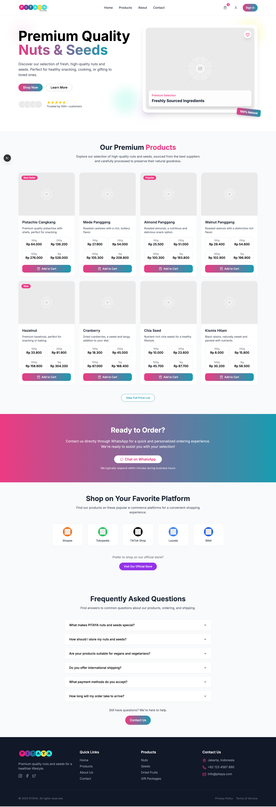

# Pitaya Store

Selamat datang di **Pitaya Store**! 🚀

Pitaya Store adalah aplikasi toko online modern yang dibangun menggunakan **Next.js 15**. Proyek ini dirancang untuk memberikan pengalaman belanja yang cepat, responsif, dan mudah digunakan, baik untuk pelanggan maupun pemilik toko.

---

## ✨ Fitur Utama
- **Next.js 15**: Menggunakan fitur terbaru dari Next.js untuk performa maksimal.
- **UI Modern & Responsif**: Tampilan menarik dan nyaman di semua perangkat.
- **Routing Dinamis**: Navigasi halaman super cepat tanpa reload.
- **SEO Friendly**: Optimasi mesin pencari otomatis.
- **Pengelolaan Produk**: Tambah, edit, hapus produk dengan mudah.
- **Keranjang Belanja**: Sistem keranjang real-time.
- **Autentikasi Pengguna**: Login & registrasi aman.

---

## 🖼️ Tampilan Landing Page



---

## 🚀 Instalasi & Menjalankan Project

1. **Clone repositori ini:**
   ```bash
   git clone https://github.com/username/pitaya-store.git
   cd pitaya-store
   ```
2. **Install dependencies:**
   ```bash
   npm install
   # atau
   yarn install
   ```
3. **Jalankan aplikasi:**
   ```bash
   npm run dev
   # atau
   yarn dev
   ```
4. Buka browser dan akses `http://localhost:3000`

---

## 📦 Struktur Proyek
```
pitaya-store/
├── app/           # Folder utama aplikasi Next.js
├── public/        # File statis (gambar, favicon, dll)
├── components/    # Komponen UI reusable
├── styles/        # File CSS/SCSS
├── package.json   # Konfigurasi dependencies
└── ...
```

---

## 🤝 Kontribusi
Kontribusi sangat terbuka! Silakan fork, buat branch, dan ajukan pull request. Jangan ragu untuk membuka issue jika menemukan bug atau ingin request fitur baru.

---

## 📄 Lisensi
MIT License

---

Dibuat dengan ❤️ oleh tim Pitaya Store.
